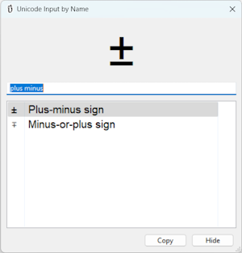

Unicode Input by Name

Fork of: http://code.google.com/p/unicode-input-by-name/

Intro
=====
Unicode-Input-By-Name (UIBN) is a little utility that helps you use Unicode characters that are not easily accessible.
You can find for the symbols you need by searching for the name of the symbol. Then it copies the desired character to the clipboard, and you can insert it into your text file.
For example, you want to insert the plus-minus symbol, then you open UIBN (press <kbd>Alt</kbd>+<kbd>+</kbd>), search for "plus minus" and then press enter. Now you can insert this symbol into your text from the clipboard (press <kbd>Ctrl</kbd> + <kbd>V</kbd>).

Usage
===========
1. Download the .zip file from the releases page
2. Unzip the downloaded file
3. Run the UIBN.exe
4. Press <kbd>Alt</kbd> + <kbd>+</kbd> to open the program window
5. type the name of the Unicode symbol you want
6. press the "Copy" button (or <kbd>Enter</kbd> ) to copy the character to the clipboard
7. Paste the character to text editor using <kbd>Ctrl</kbd> + <kbd>V</kbd>

Running (Windows)
==========================

You may need to install Visual C++ 2008 Redistributable 
https://www.microsoft.com/de-de/download/details.aspx?id=26368
and Microsoft Visual C++ Redistributable für Visual Studio 2022
https://learn.microsoft.com/de-de/cpp/windows/latest-supported-vc-redist?view=msvc-170#latest-microsoft-visual-c-redistributable-version

Download the Windows binary version, unzip the files to
a writable place on your disk.
Run uibn.exe to start the program.
It automatically is minimized to the tray bar. Click the notification area icon or press
<kbd>Alt</kbd>+<kbd>+</kbd> (the Alt key and the "+" on the numeric pad) to show the program.

Running (from source code)
==========================

If you downloaded the source code, you should have wxPython (2.8.x.x) installed
in order to run UIbN. Just execyte uibn.pyw.

Tested with Python 3.11.7

python -m venv .venev
.venv/Scripts/Activate
pip install -r requirements.txt

Customization
=============
Use Explorer to go to %APPDATA%\unicode-input-by-name and create a text file with the name:
uibn_settings.ini
The contents can currently be like this:

    [Appearance]
    font_size_pt_current_char = 60
    font_size_candidate_list = 13
